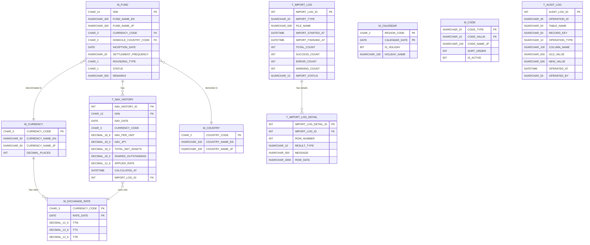

# DB論理設計書

## 外国籍投資信託管理システム

| 項目 | 内容 |
|------|------|
| 文書番号 | BD-001 |
| 版数 | 1.0 |
| 作成日 | 2026-02-20 |
| 最終更新日 | 2026-02-20 |

### 改訂履歴

| 版数 | 日付 | 変更内容 | 作成者 |
|------|------|----------|--------|
| 1.0 | 2026-02-20 | 初版作成 | ― |

---

## 1. 設計方針

### 1.1 命名規則

| 対象 | 規則 | 例 |
|------|------|-----|
| マスタテーブル | `M_` プレフィックス + 大文字スネークケース | M_FUND, M_CURRENCY |
| トランザクションテーブル | `T_` プレフィックス + 大文字スネークケース | T_NAV_HISTORY, T_AUDIT_LOG |
| カラム名 | 大文字スネークケース | FUND_NAME_EN, NAV_PER_UNIT |
| 主キー制約 | `PK_テーブル名` | PK_M_FUND |
| ユニーク制約 | `UQ_テーブル名_カラム名` | UQ_T_NAV_HISTORY_ISIN_DATE |
| 外部キー制約 | `FK_子テーブル名_親テーブル名` | FK_M_FUND_M_CURRENCY |
| インデックス | `IX_テーブル名_カラム名` | IX_T_NAV_HISTORY_NAV_DATE |

### 1.2 共通カラム

全テーブルに以下の監査用カラムを付与する。

| カラム名 | 型 | NULL | 説明 |
|---------|-----|------|------|
| CREATED_AT | DATETIME | NOT NULL | レコード作成日時 |
| CREATED_BY | NVARCHAR(50) | NOT NULL | 作成者（設定ファイルのユーザー名） |
| UPDATED_AT | DATETIME | NOT NULL | 最終更新日時 |
| UPDATED_BY | NVARCHAR(50) | NOT NULL | 最終更新者 |

### 1.3 主キー設計方針

| テーブル種別 | 方針 | 理由 |
|-------------|------|------|
| マスタテーブル | 業務キー（自然キー）を主キーとする | コードそのものが業務上の識別子であり、代理キーは冗長 |
| トランザクションテーブル | 代理キー（INT IDENTITY）を主キーとし、業務キーにはユニーク制約を付与 | FK参照・拡張性・ORMとの親和性を考慮 |

### 1.4 データ型方針

| データ種別 | 型 | 備考 |
|-----------|-----|------|
| 金額・価額 | DECIMAL | Float / Double は丸め誤差のため使用禁止 |
| コード値 | CHAR(n) | 固定長コード（ISIN, 通貨コード等） |
| 名称 | NVARCHAR(n) | 日本語対応のためNVARCHAR |
| 日付 | DATE | 時刻不要の業務日付 |
| 日時 | DATETIME | 操作日時・処理日時 |
| フラグ | BIT | 0 / 1 の二値 |

---

## 2. ER図

---

## 3. テーブル定義

### 3.1 M_FUND（ファンドマスタ）

ファンドの基本情報を管理する。論理削除方式を採用し、物理削除は行わない。

| # | カラム名 | 論理名 | 型 | NULL | デフォルト | 説明 |
|---|---------|--------|-----|------|-----------|------|
| 1 | ISIN | ISIN コード | CHAR(12) | NOT NULL | ― | 主キー。国際証券識別番号（チェックディジット検証あり） |
| 2 | FUND_NAME_EN | ファンド名称（英語） | NVARCHAR(200) | NOT NULL | ― | 英語の正式名称 |
| 3 | FUND_NAME_JP | ファンド名称（日本語） | NVARCHAR(200) | NOT NULL | ― | 日本語の表示名称 |
| 4 | CURRENCY_CODE | 通貨コード | CHAR(3) | NOT NULL | ― | ISO 4217。M_CURRENCY への FK |
| 5 | DOMICILE_COUNTRY_CODE | 籍国コード | CHAR(2) | NOT NULL | ― | ISO 3166-1 alpha-2。M_COUNTRY への FK |
| 6 | INCEPTION_DATE | 設定日 | DATE | NOT NULL | ― | ファンドの運用開始日。未来日不可 |
| 7 | SETTLEMENT_FREQUENCY | 決算頻度 | NVARCHAR(20) | NOT NULL | ― | M_CODE（CODE_TYPE='SETTLEMENT_FREQ'）参照 |
| 8 | ROUNDING_TYPE | 端数処理区分 | CHAR(1) | NOT NULL | ― | 1:切捨て / 2:四捨五入 / 3:切上げ。M_CODE 参照 |
| 9 | STATUS | ステータス | CHAR(1) | NOT NULL | '1' | 1:有効 / 9:論理削除。M_CODE 参照 |
| 10 | REMARKS | 備考 | NVARCHAR(500) | NULL | ― | 自由記述 |
| 11 | CREATED_AT | 作成日時 | DATETIME | NOT NULL | ― | 共通カラム |
| 12 | CREATED_BY | 作成者 | NVARCHAR(50) | NOT NULL | ― | 共通カラム |
| 13 | UPDATED_AT | 更新日時 | DATETIME | NOT NULL | ― | 共通カラム |
| 14 | UPDATED_BY | 更新者 | NVARCHAR(50) | NOT NULL | ― | 共通カラム |

**制約**

| 制約名 | 種別 | 対象カラム |
|--------|------|-----------|
| PK_M_FUND | PRIMARY KEY | ISIN |
| FK_M_FUND_M_CURRENCY | FOREIGN KEY | CURRENCY_CODE → M_CURRENCY.CURRENCY_CODE |
| FK_M_FUND_M_COUNTRY | FOREIGN KEY | DOMICILE_COUNTRY_CODE → M_COUNTRY.COUNTRY_CODE |

---

### 3.2 M_CURRENCY（通貨マスタ）

ISO 4217 に基づく通貨コードを管理する。為替レート登録・ファンドマスタの通貨コードバリデーションに使用する。

| # | カラム名 | 論理名 | 型 | NULL | デフォルト | 説明 |
|---|---------|--------|-----|------|-----------|------|
| 1 | CURRENCY_CODE | 通貨コード | CHAR(3) | NOT NULL | ― | 主キー。ISO 4217（USD, EUR, GBP等） |
| 2 | CURRENCY_NAME_EN | 通貨名称（英語） | NVARCHAR(50) | NOT NULL | ― | US Dollar, Euro 等 |
| 3 | CURRENCY_NAME_JP | 通貨名称（日本語） | NVARCHAR(50) | NOT NULL | ― | 米ドル, ユーロ 等 |
| 4 | DECIMAL_PLACES | 小数桁数 | INT | NOT NULL | ― | 当該通貨の標準小数桁数（JPY=0, USD=2 等） |
| 5 | CREATED_AT | 作成日時 | DATETIME | NOT NULL | ― | 共通カラム |
| 6 | CREATED_BY | 作成者 | NVARCHAR(50) | NOT NULL | ― | 共通カラム |
| 7 | UPDATED_AT | 更新日時 | DATETIME | NOT NULL | ― | 共通カラム |
| 8 | UPDATED_BY | 更新者 | NVARCHAR(50) | NOT NULL | ― | 共通カラム |

**制約**

| 制約名 | 種別 | 対象カラム |
|--------|------|-----------|
| PK_M_CURRENCY | PRIMARY KEY | CURRENCY_CODE |

---

### 3.3 M_COUNTRY（籍国マスタ）

ISO 3166-1 alpha-2 に基づく国コードを管理する。ファンドの籍国コードバリデーションに使用する。

| # | カラム名 | 論理名 | 型 | NULL | デフォルト | 説明 |
|---|---------|--------|-----|------|-----------|------|
| 1 | COUNTRY_CODE | 国コード | CHAR(2) | NOT NULL | ― | 主キー。ISO 3166-1 alpha-2（LU, KY, IE等） |
| 2 | COUNTRY_NAME_EN | 国名（英語） | NVARCHAR(100) | NOT NULL | ― | Luxembourg, Cayman Islands 等 |
| 3 | COUNTRY_NAME_JP | 国名（日本語） | NVARCHAR(100) | NOT NULL | ― | ルクセンブルク, ケイマン諸島 等 |
| 4 | CREATED_AT | 作成日時 | DATETIME | NOT NULL | ― | 共通カラム |
| 5 | CREATED_BY | 作成者 | NVARCHAR(50) | NOT NULL | ― | 共通カラム |
| 6 | UPDATED_AT | 更新日時 | DATETIME | NOT NULL | ― | 共通カラム |
| 7 | UPDATED_BY | 更新者 | NVARCHAR(50) | NOT NULL | ― | 共通カラム |

**制約**

| 制約名 | 種別 | 対象カラム |
|--------|------|-----------|
| PK_M_COUNTRY | PRIMARY KEY | COUNTRY_CODE |

---

### 3.4 M_EXCHANGE_RATE（為替レートマスタ）

銀行公表の対円為替レート（TTM / TTS / TTB）を日次で管理する。横持ち方式（1レコードに3種別を格納）を採用する。

| # | カラム名 | 論理名 | 型 | NULL | デフォルト | 説明 |
|---|---------|--------|-----|------|-----------|------|
| 1 | CURRENCY_CODE | 通貨コード | CHAR(3) | NOT NULL | ― | 複合主キー①。M_CURRENCY への FK |
| 2 | RATE_DATE | 基準日 | DATE | NOT NULL | ― | 複合主キー②。レート公表日 |
| 3 | TTM | 仲値 | DECIMAL(12,6) | NOT NULL | ― | Telegraphic Transfer Middle rate |
| 4 | TTS | 売レート | DECIMAL(12,6) | NOT NULL | ― | Telegraphic Transfer Selling rate |
| 5 | TTB | 買レート | DECIMAL(12,6) | NOT NULL | ― | Telegraphic Transfer Buying rate |
| 6 | CREATED_AT | 作成日時 | DATETIME | NOT NULL | ― | 共通カラム |
| 7 | CREATED_BY | 作成者 | NVARCHAR(50) | NOT NULL | ― | 共通カラム |
| 8 | UPDATED_AT | 更新日時 | DATETIME | NOT NULL | ― | 共通カラム |
| 9 | UPDATED_BY | 更新者 | NVARCHAR(50) | NOT NULL | ― | 共通カラム |

**制約**

| 制約名 | 種別 | 対象カラム |
|--------|------|-----------|
| PK_M_EXCHANGE_RATE | PRIMARY KEY | CURRENCY_CODE, RATE_DATE |
| FK_M_EXCHANGE_RATE_M_CURRENCY | FOREIGN KEY | CURRENCY_CODE → M_CURRENCY.CURRENCY_CODE |
| CK_M_EXCHANGE_RATE_ORDER | CHECK | TTB <= TTM AND TTM <= TTS |

---

### 3.5 M_CALENDAR（営業日カレンダー）

日本・米国・ルクセンブルクの3地域の祝日・臨時休業日を管理する。土日の判定はアプリケーション側で行い、本テーブルには祝日・臨時休業日のみ登録する。

| # | カラム名 | 論理名 | 型 | NULL | デフォルト | 説明 |
|---|---------|--------|-----|------|-----------|------|
| 1 | REGION_CODE | 地域コード | CHAR(2) | NOT NULL | ― | 複合主キー①。JP / US / LU |
| 2 | CALENDAR_DATE | 日付 | DATE | NOT NULL | ― | 複合主キー② |
| 3 | IS_HOLIDAY | 休日フラグ | BIT | NOT NULL | ― | 1:休日 / 0:営業日 |
| 4 | HOLIDAY_NAME | 休日名称 | NVARCHAR(100) | NULL | ― | 祝日の名称（元日、MLK Day 等） |
| 5 | CREATED_AT | 作成日時 | DATETIME | NOT NULL | ― | 共通カラム |
| 6 | CREATED_BY | 作成者 | NVARCHAR(50) | NOT NULL | ― | 共通カラム |
| 7 | UPDATED_AT | 更新日時 | DATETIME | NOT NULL | ― | 共通カラム |
| 8 | UPDATED_BY | 更新者 | NVARCHAR(50) | NOT NULL | ― | 共通カラム |

**制約**

| 制約名 | 種別 | 対象カラム |
|--------|------|-----------|
| PK_M_CALENDAR | PRIMARY KEY | REGION_CODE, CALENDAR_DATE |

---

### 3.6 M_CODE（汎用コードマスタ）

区分値・コード値を一元管理する汎用マスタ。ハードコーディングの排除と、コード値の追加・変更を容易にする目的で導入する。

| # | カラム名 | 論理名 | 型 | NULL | デフォルト | 説明 |
|---|---------|--------|-----|------|-----------|------|
| 1 | CODE_TYPE | コード種別 | NVARCHAR(20) | NOT NULL | ― | 複合主キー①。コードの分類（ROUNDING_TYPE 等） |
| 2 | CODE_VALUE | コード値 | NVARCHAR(10) | NOT NULL | ― | 複合主キー②。実際の値（1, 2, 3 等） |
| 3 | CODE_NAME_JP | コード名称 | NVARCHAR(100) | NOT NULL | ― | 画面表示用の日本語名称 |
| 4 | SORT_ORDER | 表示順 | INT | NOT NULL | 0 | 画面ドロップダウン等での並び順 |
| 5 | IS_ACTIVE | 有効フラグ | BIT | NOT NULL | 1 | 0:無効 / 1:有効 |
| 6 | CREATED_AT | 作成日時 | DATETIME | NOT NULL | ― | 共通カラム |
| 7 | CREATED_BY | 作成者 | NVARCHAR(50) | NOT NULL | ― | 共通カラム |
| 8 | UPDATED_AT | 更新日時 | DATETIME | NOT NULL | ― | 共通カラム |
| 9 | UPDATED_BY | 更新者 | NVARCHAR(50) | NOT NULL | ― | 共通カラム |

**制約**

| 制約名 | 種別 | 対象カラム |
|--------|------|-----------|
| PK_M_CODE | PRIMARY KEY | CODE_TYPE, CODE_VALUE |

**初期データ**

| CODE_TYPE | CODE_VALUE | CODE_NAME_JP | SORT_ORDER |
|-----------|-----------|-------------|-----------|
| ROUNDING_TYPE | 1 | 切捨て | 1 |
| ROUNDING_TYPE | 2 | 四捨五入 | 2 |
| ROUNDING_TYPE | 3 | 切上げ | 3 |
| SETTLEMENT_FREQ | 01 | 年1回 | 1 |
| SETTLEMENT_FREQ | 02 | 年2回 | 2 |
| SETTLEMENT_FREQ | 03 | 四半期 | 3 |
| SETTLEMENT_FREQ | 04 | 毎月 | 4 |
| FUND_STATUS | 1 | 有効 | 1 |
| FUND_STATUS | 9 | 論理削除 | 2 |
| REGION_CODE | JP | 日本 | 1 |
| REGION_CODE | US | 米国 | 2 |
| REGION_CODE | LU | ルクセンブルク | 3 |
| RATE_TYPE | TTM | 仲値 | 1 |
| RATE_TYPE | TTS | 売レート | 2 |
| RATE_TYPE | TTB | 買レート | 3 |
| IMPORT_TYPE | NAV | NAVデータ | 1 |
| IMPORT_TYPE | RATE | 為替レート | 2 |
| IMPORT_TYPE | CAL | 営業日カレンダー | 3 |

---

### 3.7 T_NAV_HISTORY（NAV履歴）

海外アドミニストレーターから受領したNAVデータおよび為替換算後の円建てNAVを日次で蓄積する。代理キー方式を採用し、業務キー（ISIN + NAV_DATE）にはユニーク制約を付与する。

| # | カラム名 | 論理名 | 型 | NULL | デフォルト | 説明 |
|---|---------|--------|-----|------|-----------|------|
| 1 | NAV_HISTORY_ID | NAV履歴ID | INT IDENTITY | NOT NULL | 自動採番 | 主キー（代理キー） |
| 2 | ISIN | ISINコード | CHAR(12) | NOT NULL | ― | M_FUND への FK |
| 3 | NAV_DATE | 基準日 | DATE | NOT NULL | ― | NAV算出日（海外営業日基準） |
| 4 | CURRENCY_CODE | 通貨コード | CHAR(3) | NOT NULL | ― | 外貨建ての通貨。M_CURRENCY への FK |
| 5 | NAV_PER_UNIT | 基準価額（外貨建て） | DECIMAL(18,6) | NOT NULL | ― | 1口あたり外貨建てNAV |
| 6 | NAV_JPY | 基準価額（円建て） | DECIMAL(18,0) | NULL | ― | 円換算後NAV。バッチ処理前はNULL |
| 7 | TOTAL_NET_ASSETS | 純資産総額 | DECIMAL(18,2) | NOT NULL | ― | ファンド全体の純資産（外貨建て） |
| 8 | SHARES_OUTSTANDING | 発行済口数 | DECIMAL(18,2) | NOT NULL | ― | 発行済口数 |
| 9 | APPLIED_RATE | 適用レート | DECIMAL(12,6) | NULL | ― | 円換算に使用したTTM。バッチ処理前はNULL |
| 10 | CALCULATED_AT | 計算日時 | DATETIME | NULL | ― | 円換算バッチの実行日時。バッチ処理前はNULL |
| 11 | IMPORT_LOG_ID | 取込履歴ID | INT | NOT NULL | ― | T_IMPORT_LOG への FK。どの取込で登録されたか |
| 12 | CREATED_AT | 作成日時 | DATETIME | NOT NULL | ― | 共通カラム |
| 13 | CREATED_BY | 作成者 | NVARCHAR(50) | NOT NULL | ― | 共通カラム |
| 14 | UPDATED_AT | 更新日時 | DATETIME | NOT NULL | ― | 共通カラム |
| 15 | UPDATED_BY | 更新者 | NVARCHAR(50) | NOT NULL | ― | 共通カラム |

**制約**

| 制約名 | 種別 | 対象カラム |
|--------|------|-----------|
| PK_T_NAV_HISTORY | PRIMARY KEY | NAV_HISTORY_ID |
| UQ_T_NAV_HISTORY_ISIN_DATE | UNIQUE | ISIN, NAV_DATE |
| FK_T_NAV_HISTORY_M_FUND | FOREIGN KEY | ISIN → M_FUND.ISIN |
| FK_T_NAV_HISTORY_M_CURRENCY | FOREIGN KEY | CURRENCY_CODE → M_CURRENCY.CURRENCY_CODE |
| FK_T_NAV_HISTORY_T_IMPORT_LOG | FOREIGN KEY | IMPORT_LOG_ID → T_IMPORT_LOG.IMPORT_LOG_ID |

**インデックス**

| インデックス名 | 対象カラム | 目的 |
|--------------|-----------|------|
| IX_T_NAV_HISTORY_NAV_DATE | NAV_DATE | 日付範囲検索の高速化（月次レポート等） |
| IX_T_NAV_HISTORY_ISIN | ISIN | ファンド指定検索の高速化 |

---

### 3.8 T_AUDIT_LOG（変更履歴）

マスタデータの変更証跡を記録する。1回の操作で複数項目が変更された場合、変更項目ごとに1レコードを生成し、OPERATION_IDで同一操作を紐づける。

| # | カラム名 | 論理名 | 型 | NULL | デフォルト | 説明 |
|---|---------|--------|-----|------|-----------|------|
| 1 | AUDIT_LOG_ID | 監査ログID | INT IDENTITY | NOT NULL | 自動採番 | 主キー（代理キー） |
| 2 | OPERATION_ID | 操作ID | NVARCHAR(36) | NOT NULL | ― | GUID。1回の操作単位を識別する |
| 3 | TABLE_NAME | テーブル名 | NVARCHAR(50) | NOT NULL | ― | 変更対象テーブル（M_FUND 等） |
| 4 | RECORD_KEY | レコードキー | NVARCHAR(50) | NOT NULL | ― | 変更対象レコードの主キー値（ISIN等） |
| 5 | OPERATION_TYPE | 操作種別 | NVARCHAR(10) | NOT NULL | ― | INSERT / UPDATE / DELETE |
| 6 | COLUMN_NAME | カラム名 | NVARCHAR(100) | NULL | ― | 変更対象カラム。INSERTの場合はNULL |
| 7 | OLD_VALUE | 変更前の値 | NVARCHAR(500) | NULL | ― | 変更前の値。INSERTの場合はNULL |
| 8 | NEW_VALUE | 変更後の値 | NVARCHAR(500) | NULL | ― | 変更後の値。DELETEの場合はNULL |
| 9 | OPERATED_AT | 操作日時 | DATETIME | NOT NULL | ― | 操作実行日時 |
| 10 | OPERATED_BY | 操作者 | NVARCHAR(50) | NOT NULL | ― | 設定ファイルのユーザー名 |

**制約**

| 制約名 | 種別 | 対象カラム |
|--------|------|-----------|
| PK_T_AUDIT_LOG | PRIMARY KEY | AUDIT_LOG_ID |

**インデックス**

| インデックス名 | 対象カラム | 目的 |
|--------------|-----------|------|
| IX_T_AUDIT_LOG_OPERATION_ID | OPERATION_ID | 同一操作のレコード群取得 |
| IX_T_AUDIT_LOG_TABLE_KEY | TABLE_NAME, RECORD_KEY | 特定レコードの変更履歴取得 |
| IX_T_AUDIT_LOG_OPERATED_AT | OPERATED_AT | 日時範囲検索 |

> **補足：T_AUDIT_LOGに共通カラム（CREATED_AT等）を付与しない理由**
> 本テーブルはINSERTのみ（追記専用）であり、更新・削除を行わない。操作日時・操作者はOPERATED_AT・OPERATED_BYカラムがその役割を果たすため、共通カラムは冗長となり省略する。

---

### 3.9 T_IMPORT_LOG（データ取込履歴）

CSV取込の実行単位で1レコードを記録する。取込の成否・件数を管理する。

| # | カラム名 | 論理名 | 型 | NULL | デフォルト | 説明 |
|---|---------|--------|-----|------|-----------|------|
| 1 | IMPORT_LOG_ID | 取込履歴ID | INT IDENTITY | NOT NULL | 自動採番 | 主キー（代理キー） |
| 2 | IMPORT_TYPE | 取込種別 | NVARCHAR(20) | NOT NULL | ― | NAV / RATE / CAL。M_CODE 参照 |
| 3 | FILE_NAME | ファイル名 | NVARCHAR(500) | NOT NULL | ― | 取込ファイルのフルパス |
| 4 | IMPORT_STARTED_AT | 取込開始日時 | DATETIME | NOT NULL | ― | 処理開始日時 |
| 5 | IMPORT_FINISHED_AT | 取込終了日時 | DATETIME | NULL | ― | 処理終了日時。処理中はNULL |
| 6 | TOTAL_COUNT | 全件数 | INT | NOT NULL | 0 | ファイル内のデータ行数 |
| 7 | SUCCESS_COUNT | 成功件数 | INT | NOT NULL | 0 | 正常取込件数 |
| 8 | ERROR_COUNT | エラー件数 | INT | NOT NULL | 0 | 形式チェック・業務チェックエラー件数 |
| 9 | WARNING_COUNT | 警告件数 | INT | NOT NULL | 0 | 業務警告件数（異常値検知等） |
| 10 | IMPORT_STATUS | 取込ステータス | NVARCHAR(10) | NOT NULL | ― | RUNNING / SUCCESS / ERROR |
| 11 | CREATED_AT | 作成日時 | DATETIME | NOT NULL | ― | 共通カラム |
| 12 | CREATED_BY | 作成者 | NVARCHAR(50) | NOT NULL | ― | 共通カラム |
| 13 | UPDATED_AT | 更新日時 | DATETIME | NOT NULL | ― | 共通カラム |
| 14 | UPDATED_BY | 更新者 | NVARCHAR(50) | NOT NULL | ― | 共通カラム |

**制約**

| 制約名 | 種別 | 対象カラム |
|--------|------|-----------|
| PK_T_IMPORT_LOG | PRIMARY KEY | IMPORT_LOG_ID |

---

### 3.10 T_IMPORT_LOG_DETAIL（データ取込明細）

CSV取込の行単位のバリデーション結果を記録する。エラー・警告が発生した行の特定と、取込結果画面での一覧表示に使用する。

| # | カラム名 | 論理名 | 型 | NULL | デフォルト | 説明 |
|---|---------|--------|-----|------|-----------|------|
| 1 | IMPORT_LOG_DETAIL_ID | 取込明細ID | INT IDENTITY | NOT NULL | 自動採番 | 主キー（代理キー） |
| 2 | IMPORT_LOG_ID | 取込履歴ID | INT | NOT NULL | ― | T_IMPORT_LOG への FK |
| 3 | ROW_NUMBER | 行番号 | INT | NOT NULL | ― | CSVファイル内の行番号（ヘッダー除く） |
| 4 | RESULT_TYPE | 結果種別 | NVARCHAR(10) | NOT NULL | ― | ERROR / WARNING |
| 5 | MESSAGE | メッセージ | NVARCHAR(500) | NOT NULL | ― | エラー・警告の内容 |
| 6 | ROW_DATA | 行データ | NVARCHAR(2000) | NULL | ― | 問題のあった行の原文（デバッグ・確認用） |
| 7 | CREATED_AT | 作成日時 | DATETIME | NOT NULL | ― | 共通カラム |
| 8 | CREATED_BY | 作成者 | NVARCHAR(50) | NOT NULL | ― | 共通カラム |
| 9 | UPDATED_AT | 更新日時 | DATETIME | NOT NULL | ― | 共通カラム |
| 10 | UPDATED_BY | 更新者 | NVARCHAR(50) | NOT NULL | ― | 共通カラム |

**制約**

| 制約名 | 種別 | 対象カラム |
|--------|------|-----------|
| PK_T_IMPORT_LOG_DETAIL | PRIMARY KEY | IMPORT_LOG_DETAIL_ID |
| FK_T_IMPORT_LOG_DETAIL_PARENT | FOREIGN KEY | IMPORT_LOG_ID → T_IMPORT_LOG.IMPORT_LOG_ID |

**インデックス**

| インデックス名 | 対象カラム | 目的 |
|--------------|-----------|------|
| IX_T_IMPORT_LOG_DETAIL_LOG_ID | IMPORT_LOG_ID | 親ログ指定での明細取得 |

---

## 4. インデックス方針

### 4.1 基本方針

| 方針 | 説明 |
|------|------|
| 主キー | 自動的にクラスタ化インデックスが作成される |
| 外部キー | FK カラムには非クラスタ化インデックスを付与する（JOIN 性能確保） |
| 検索条件 | 画面の検索条件・バッチの抽出条件に頻出するカラムにインデックスを付与する |
| 過剰なインデックスの回避 | 本システムのデータ量（年間数千件規模）では過剰なインデックスは不要。更新性能への悪影響を避ける |

### 4.2 インデックス一覧（主キー・ユニーク制約を除く）

| テーブル | インデックス名 | カラム | 目的 |
|---------|--------------|--------|------|
| T_NAV_HISTORY | IX_T_NAV_HISTORY_NAV_DATE | NAV_DATE | 日付範囲でのNAV取得（月次レポート、バッチ対象抽出） |
| T_NAV_HISTORY | IX_T_NAV_HISTORY_ISIN | ISIN | ファンド指定での履歴取得 |
| T_AUDIT_LOG | IX_T_AUDIT_LOG_OPERATION_ID | OPERATION_ID | 同一操作の変更項目一括取得 |
| T_AUDIT_LOG | IX_T_AUDIT_LOG_TABLE_KEY | TABLE_NAME, RECORD_KEY | 特定レコードの変更履歴一覧 |
| T_AUDIT_LOG | IX_T_AUDIT_LOG_OPERATED_AT | OPERATED_AT | 日時範囲での監査ログ検索 |
| T_IMPORT_LOG_DETAIL | IX_T_IMPORT_LOG_DETAIL_LOG_ID | IMPORT_LOG_ID | 取込明細の親ログ別取得 |

---

## 5. データ整合性ルール

### 5.1 参照整合性（外部キー）

| 子テーブル | 親テーブル | ON DELETE | ON UPDATE |
|-----------|-----------|-----------|-----------|
| M_FUND → M_CURRENCY | M_CURRENCY | RESTRICT | RESTRICT |
| M_FUND → M_COUNTRY | M_COUNTRY | RESTRICT | RESTRICT |
| M_EXCHANGE_RATE → M_CURRENCY | M_CURRENCY | RESTRICT | RESTRICT |
| T_NAV_HISTORY → M_FUND | M_FUND | RESTRICT | RESTRICT |
| T_NAV_HISTORY → M_CURRENCY | M_CURRENCY | RESTRICT | RESTRICT |
| T_NAV_HISTORY → T_IMPORT_LOG | T_IMPORT_LOG | RESTRICT | RESTRICT |
| T_IMPORT_LOG_DETAIL → T_IMPORT_LOG | T_IMPORT_LOG | CASCADE | RESTRICT |

> **CASCADE の適用はT_IMPORT_LOG_DETAIL のみ。** 取込ログを削除する場合（運用上はまれ）、明細も連動削除する。それ以外はすべて RESTRICT とし、参照先の不整合な削除を防止する。

### 5.2 CHECK 制約

| テーブル | 制約 | ルール |
|---------|------|--------|
| M_EXCHANGE_RATE | CK_M_EXCHANGE_RATE_ORDER | TTB <= TTM AND TTM <= TTS |

### 5.3 論理削除

M_FUND テーブルのみ論理削除方式を採用する。STATUS = '9' のレコードは画面上「削除済み」として扱い、通常の検索結果には表示しない。物理削除は行わない。

---

以上
