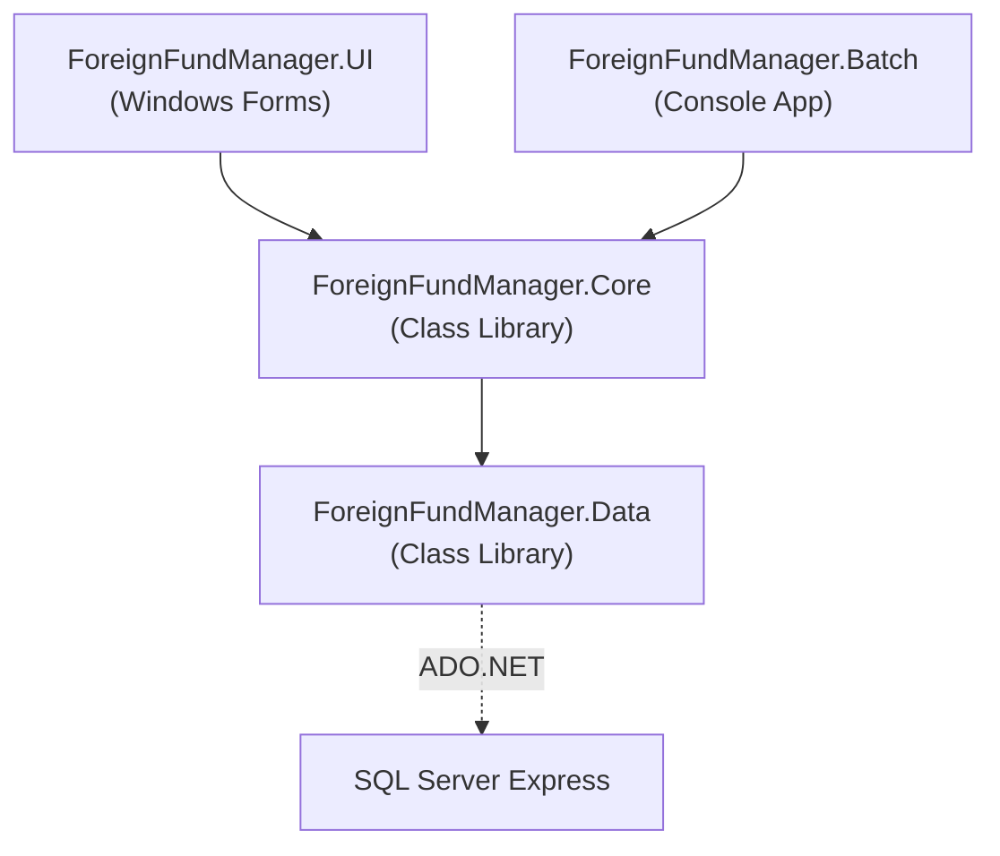

# システム構成設計書

## 外国籍投資信託管理システム

| 項目 | 内容 |
|------|------|
| 文書番号 | BD-002 |
| 版数 | 1.0 |
| 作成日 | 2026-02-20 |
| 最終更新日 | 2026-02-20 |

### 改訂履歴

| 版数 | 日付 | 変更内容 | 作成者 |
|------|------|----------|--------|
| 1.0 | 2026-02-20 | 初版作成 | ― |

---

## 1. アーキテクチャ概要

### 1.1 全体構成図

```
┌───────────────────────────────────────────────────────────────┐
│  クライアントPC（Windows 10 以降）                              │
│                                                               │
│  ┌─────────────────────┐   ┌─────────────────────────┐        │
│  │  ForeignFundManager │   │  ForeignFundManager     │        │
│  │  .UI                │   │  .Batch                 │        │
│  │  (Windows Forms)    │   │  (Console Application)  │        │
│  │                     │   │                         │        │
│  │  ・ファンドマスタ管理 │   │  ・基準価額計算バッチ     │        │
│  │  ・為替レート管理     │   │                         │        │
│  │  ・営業日カレンダー   │   │                         │        │
│  │  ・データ取込        │   │                          │        │
│  │  ・帳票出力          │   │                          │        │
│  │  ・バッチ手動実行     │   │                          │       │
│  └──────────┬──────────┘    └────────────┬────────────┘        │
│             │  参照                       │  参照               │
│             └──────────┬─────────────────┘                     │
│                        ▼                                       │
│           ┌──────────────────────────┐                         │
│           │  ForeignFundManager.Core  │                        │
│           │  (Class Library)          │                        │
│           │                           │                        │
│           │  ・ファンドマスタサービス    │                       │
│           │  ・為替レートサービス       │                        │
│           │  ・営業日カレンダーサービス  │                        │
│           │  ・データ取込サービス       │                        │
│           │  ・基準価額計算サービス     │                        │
│           │  ・帳票出力サービス        │                         │
│           │  ・バリデーション          │                         │
│           │  ・共通ユーティリティ      │                         │
│           └────────────┬─────────────┘                         │
│                        │  参照                                 │
│                        ▼                                       │
│           ┌──────────────────────────┐                         │
│           │  ForeignFundManager.Data │                         │
│           │  (Class Library)         │                         │
│           │                          │                         │
│           │  ・リポジトリクラス群      │                         │
│           │  ・DB接続管理             │                         │
│           │  ・SQL定義               │                          │
│           └────────────┬─────────────┘                         │
│                        │                                       │
└────────────────────────┼───────────────────────────────────────┘
                         │  ADO.NET（SqlConnection / SqlCommand）
                         ▼
                 ┌───────────────┐
                 │  SQL Server   │
                 │  Express 2019 │
                 └───────────────┘
```

### 1.2 レイヤー構成

3層アーキテクチャを採用する。各層の責務を明確に分離し、依存方向を上位層→下位層の一方向に限定する。

| 層 | プロジェクト | 責務 |
|----|------------|------|
| プレゼンテーション層 | UI / Batch | ユーザーとの対話、画面制御、バッチのエントリーポイント |
| ビジネスロジック層 | Core | 業務ルールの実装、バリデーション、計算処理 |
| データアクセス層 | Data | DB操作の実行、SQL発行、接続管理 |

**依存関係のルール：**
- UI → Core → Data の順で参照する（一方向）
- Data 層は他のプロジェクトを参照しない
- Core 層は UI / Batch を参照しない
- UI と Batch は互いを参照しない

---

## 2. プロジェクト構成

### 2.1 ソリューション構成

```
ForeignFundManager.sln
│
├─ ForeignFundManager.UI/                  … Windows Forms アプリケーション
│   ├─ Forms/                              … 画面（Form クラス）
│   │   ├─ FrmMain.vb                      … メイン画面（MDI 親）
│   │   ├─ FrmFundList.vb                  … ファンド一覧画面
│   │   ├─ FrmFundEdit.vb                  … ファンド登録・編集画面
│   │   ├─ FrmFundHistory.vb               … ファンド変更履歴画面
│   │   ├─ FrmExchangeRateList.vb          … 為替レート一覧画面
│   │   ├─ FrmExchangeRateEdit.vb          … 為替レート登録画面
│   │   ├─ FrmCalendar.vb                  … 営業日カレンダー画面
│   │   ├─ FrmDataImport.vb               … データ取込画面
│   │   ├─ FrmBatchExecution.vb            … バッチ手動実行画面
│   │   └─ FrmReportOutput.vb             … 帳票出力画面
│   ├─ App.config                          … アプリケーション設定
│   └─ Program.vb                          … エントリーポイント
│
├─ ForeignFundManager.Batch/               … コンソールアプリケーション
│   ├─ App.config                          … アプリケーション設定
│   └─ Program.vb                          … エントリーポイント
│
├─ ForeignFundManager.Core/                … クラスライブラリ
│   ├─ Services/                           … ビジネスロジック（サービスクラス）
│   │   ├─ FundService.vb                  … ファンドマスタ管理
│   │   ├─ ExchangeRateService.vb          … 為替レート管理
│   │   ├─ CalendarService.vb              … 営業日カレンダー管理
│   │   ├─ DataImportService.vb            … データ取込処理
│   │   ├─ NavCalculationService.vb        … 基準価額計算
│   │   └─ ReportService.vb               … 帳票出力
│   ├─ Validators/                         … バリデーション
│   │   ├─ IsinValidator.vb                … ISIN チェックディジット検証
│   │   ├─ NavDataValidator.vb             … NAV データバリデーション
│   │   ├─ ExchangeRateValidator.vb        … 為替レートバリデーション
│   │   └─ CalendarValidator.vb            … 営業日カレンダーバリデーション
│   ├─ Models/                             … データモデル（エンティティクラス）
│   │   ├─ Fund.vb                         … ファンドマスタ
│   │   ├─ ExchangeRate.vb                 … 為替レート
│   │   ├─ BusinessCalendar.vb             … 営業日カレンダー
│   │   ├─ NavHistory.vb                   … NAV 履歴
│   │   ├─ AuditLog.vb                     … 変更履歴
│   │   ├─ ImportLog.vb                    … 取込履歴
│   │   ├─ ImportLogDetail.vb              … 取込明細
│   │   └─ CodeMaster.vb                   … 汎用コード
│   ├─ Utils/                              … 共通ユーティリティ
│   │   ├─ AppConfig.vb                    … 設定ファイル読込
│   │   ├─ RoundingHelper.vb               … 端数処理ヘルパー
│   │   └─ CsvHelper.vb                    … CSV 読込・書出ヘルパー
│   └─ Constants/                          … 定数定義
│       ├─ AppConstants.vb                 … アプリケーション定数
│       └─ MessageConstants.vb             … メッセージ定数
│
├─ ForeignFundManager.Data/                … クラスライブラリ
│   ├─ Repositories/                       … リポジトリ（テーブル単位のDB操作）
│   │   ├─ FundRepository.vb               … M_FUND 操作
│   │   ├─ CurrencyRepository.vb           … M_CURRENCY 操作
│   │   ├─ CountryRepository.vb            … M_COUNTRY 操作
│   │   ├─ ExchangeRateRepository.vb       … M_EXCHANGE_RATE 操作
│   │   ├─ CalendarRepository.vb           … M_CALENDAR 操作
│   │   ├─ CodeRepository.vb               … M_CODE 操作
│   │   ├─ NavHistoryRepository.vb         … T_NAV_HISTORY 操作
│   │   ├─ AuditLogRepository.vb           … T_AUDIT_LOG 操作
│   │   ├─ ImportLogRepository.vb          … T_IMPORT_LOG 操作
│   │   └─ ImportLogDetailRepository.vb    … T_IMPORT_LOG_DETAIL 操作
│   └─ Infrastructure/                     … DB基盤
│       └─ DbConnectionFactory.vb          … DB接続生成・管理
│
├─ docs/                                   … 設計書格納フォルダ
│   ├─ 00_業界知識_外国籍投資信託管理システム.md
│   ├─ 01_要件定義書.md
│   ├─ 02_01_DB論理設計.md
│   ├─ 02_02_システム構成設計.md              … 本書
│   └─ ...
│
├─ sql/                                    … SQL スクリプト格納フォルダ
│   ├─ 01_CREATE_TABLES.sql                … テーブル作成
│   ├─ 02_CREATE_INDEXES.sql               … インデックス作成
│   ├─ 03_INSERT_MASTER_DATA.sql           … マスタ初期データ投入
│   └─ 04_INSERT_SAMPLE_DATA.sql           … 模擬データ投入
│
└─ README.md                               … プロジェクト概要
```

### 2.2 プロジェクト間の参照関係



### 2.3 各プロジェクトの詳細

#### ForeignFundManager.UI（プレゼンテーション層：画面）

| 項目 | 内容 |
|------|------|
| プロジェクト種別 | Windows Forms アプリケーション |
| ターゲット | .NET Framework 4.8 |
| 責務 | 画面表示、ユーザー入力の受付、サービス層の呼び出し、結果の画面反映 |
| 参照先 | ForeignFundManager.Core |

**設計方針：**
- MDI（Multiple Document Interface）方式を採用し、メイン画面を親ウィンドウとする
- 画面クラスにはビジネスロジックを記述しない（サービスクラスに委譲）
- 画面の入力値チェック（桁数・形式等の簡易チェック）は画面側で行い、業務バリデーションはサービス層で行う

#### ForeignFundManager.Batch（プレゼンテーション層：バッチ）

| 項目 | 内容 |
|------|------|
| プロジェクト種別 | コンソールアプリケーション |
| ターゲット | .NET Framework 4.8 |
| 責務 | コマンドライン引数の解析、サービス層の呼び出し、終了コードの返却 |
| 参照先 | ForeignFundManager.Core |

**設計方針：**
- コマンドライン引数で対象日付を受け取る（省略時は当日日付）
- タスクスケジューラからの日次自動実行を想定
- 終了コード：0=正常、1=一部エラー（スキップあり）、9=異常終了

#### ForeignFundManager.Core（ビジネスロジック層）

| 項目 | 内容 |
|------|------|
| プロジェクト種別 | クラスライブラリ |
| ターゲット | .NET Framework 4.8 |
| 責務 | 業務ルールの実装、バリデーション、為替換算計算、帳票データ生成 |
| 参照先 | ForeignFundManager.Data |

**設計方針：**
- テーブル単位ではなく「業務機能単位」でサービスクラスを分割する
- サービスクラスは複数のリポジトリを組み合わせて業務処理を実行する
- バリデーションは Validators フォルダに独立クラスとして配置し、サービスから呼び出す

#### ForeignFundManager.Data（データアクセス層）

| 項目 | 内容 |
|------|------|
| プロジェクト種別 | クラスライブラリ |
| ターゲット | .NET Framework 4.8 |
| 責務 | DB接続管理、SQL発行、結果のモデルへのマッピング |
| 参照先 | なし（最下層） |

**設計方針：**
- テーブル単位でリポジトリクラスを作成する（リポジトリパターン）
- すべてのSQL発行はパラメータ化クエリを使用する（SQLインジェクション対策）
- DB接続文字列は App.config から取得する
- トランザクション管理はサービス層から渡された SqlTransaction を利用する

---

## 3. 技術スタック

### 3.1 実行環境

| 項目 | 仕様 |
|------|------|
| OS | Windows 10 以降 |
| ランタイム | .NET Framework 4.8 |
| データベース | SQL Server Express 2019 以降 |
| IDE | Visual Studio 2022（Community Edition 可） |

### 3.2 使用ライブラリ

| ライブラリ | バージョン | 用途 | 入手方法 |
|-----------|----------|------|---------|
| EPPlus | 4.5.3.3 | Excel ファイル（.xlsx）の生成 | NuGet |
| NLog | 5.x | ログ出力（ファイル出力、日次ローテーション） | NuGet |
| System.Data.SqlClient | ― | DB接続（.NET Framework 標準） | 標準ライブラリ |

> **EPPlus のバージョンについて：** EPPlus 5.x 以降は商用ライセンスが必要なため、LGPL ライセンスの 4.5.3.3 を使用する。ポートフォリオ（非商用）であれば 5.x 以降も利用可能だが、実務での採用実績を考慮し 4.x 系を選定する。

### 3.3 技術選定の根拠

| 選定項目 | 選定理由 |
|---------|---------|
| VB.NET | 対象案件の必須スキル。銀行系では VB6 → VB.NET 移行の実績が多い |
| .NET Framework 4.8 | 銀行系のオンプレ環境では最も普及しているランタイム。Windows Server との親和性が高い |
| Windows Forms | 業務アプリケーションのUIとして銀行系で広く採用されている。WPFに比べ学習コストが低く、レガシーシステムとの整合性が良い |
| ADO.NET 直接 | SQL の制御が明示的に行え、パフォーマンスチューニングが容易。銀行系では ORM より直接制御が好まれる |
| SQL Server Express | 要件定義書の指定。Windows 環境との親和性が高く、SSMS による運用が容易 |

---

## 4. DB接続設計

### 4.1 接続文字列

App.config に以下の形式で接続文字列を定義する。UI プロジェクトと Batch プロジェクトで同一の接続先を使用する。

```xml
<connectionStrings>
  <add name="ForeignFundManager"
       connectionString="Data Source=.\SQLEXPRESS;Initial Catalog=ForeignFundManager;Integrated Security=True"
       providerName="System.Data.SqlClient" />
</connectionStrings>
```

### 4.2 接続管理方針

| 項目 | 方針 |
|------|------|
| 接続の取得 | DbConnectionFactory クラスで一元管理する |
| 接続のスコープ | Using ブロックで都度 Open / Close する（接続プーリングに委ねる） |
| トランザクション | 複数テーブルへの書込が伴う処理は、サービス層で SqlTransaction を生成し、リポジトリに渡す |
| タイムアウト | 接続タイムアウト：30秒（既定値）、コマンドタイムアウト：60秒 |

### 4.3 トランザクション管理

```
サービス層での処理フロー：

Using connection = DbConnectionFactory.CreateConnection()
    connection.Open()
    Using transaction = connection.BeginTransaction()
        Try
            repository1.Insert(data1, transaction)
            repository2.Update(data2, transaction)
            auditLogRepository.Insert(auditLog, transaction)
            transaction.Commit()
        Catch ex As Exception
            transaction.Rollback()
            Throw
        End Try
    End Using
End Using
```

**トランザクション境界の原則：**
- 1つの業務操作（画面のボタン押下、バッチの1レコード処理）を1トランザクションとする
- 監査ログ（T_AUDIT_LOG）の書込は業務データと同一トランザクション内で行う
- CSV取込はオールオアナッシング方式のため、全件の INSERT を1トランザクションで実行する

---

## 5. ログ設計

### 5.1 NLog 設定

NLog.config を各プロジェクトの出力ディレクトリに配置する。

```xml
<nlog>
  <targets>
    <target name="file" xsi:type="File"
            fileName="${basedir}/logs/app_${shortdate}.log"
            layout="${longdate} [${level:uppercase=true:padding=-5}] ${logger} - ${message} ${exception:format=tostring}"
            encoding="utf-8"
            maxArchiveDays="90" />
  </targets>
  <rules>
    <logger name="*" minlevel="Info" writeTo="file" />
  </rules>
</nlog>
```

### 5.2 ログレベルの使い分け

| レベル | 用途 | 具体例 |
|-------|------|--------|
| INFO | 正常系の処理記録 | 「バッチ処理開始：対象日付=2025-01-15」「CSV取込完了：10件成功」 |
| WARN | 業務上の警告（処理は続行） | 「NAV変動率が閾値超過：ISIN=LU0123456789, 変動率=12.5%」「直前営業日レートを使用：2025-01-14のTTMを適用」 |
| ERROR | 業務エラー（当該処理は失敗） | 「バリデーション失敗：行3 ISINが未登録」「為替レート取得不可：USD 2025-01-15」 |
| FATAL | システムエラー（アプリ続行不可の可能性） | 「DB接続失敗」「ファイルI/O例外」 |

### 5.3 ログ出力箇所

| 層 | 出力内容 |
|----|---------|
| プレゼンテーション層 | 画面操作の開始・終了（INFO）、未ハンドル例外（FATAL） |
| ビジネスロジック層 | 業務処理の開始・終了（INFO）、バリデーション結果（ERROR/WARN）、計算結果（INFO） |
| データアクセス層 | SQL実行エラー（ERROR）、接続エラー（FATAL） |

---

## 6. エラーハンドリング設計

### 6.1 例外の分類

| 例外種別 | クラス | 発生場面 | 処理方針 |
|---------|--------|---------|---------|
| 業務例外 | BusinessException（独自定義） | バリデーション失敗、業務ルール違反 | 画面にメッセージ表示。ログはERRORレベル |
| システム例外 | SqlException, IOException 等 | DB接続失敗、ファイルアクセスエラー | 画面に汎用エラーメッセージ表示。ログはFATALレベル |

### 6.2 例外の伝播

```
Data層        → SqlException 等をそのまま Throw
                 （Data層ではキャッチしない）
    ↓
Core層        → 業務エラーは BusinessException に変換して Throw
              → システム例外はそのまま上位へ Throw
    ↓
UI / Batch層  → BusinessException → ユーザーにメッセージ表示
              → その他の Exception → 「システムエラーが発生しました」と表示
              → すべての例外をログに記録
```

### 6.3 独自例外クラス

```vb
''' <summary>
''' 業務エラーを表す例外クラス。
''' バリデーション失敗や業務ルール違反時に使用する。
''' </summary>
Public Class BusinessException
    Inherits Exception

    Public Property ErrorCode As String
    Public Property FieldName As String

    Public Sub New(message As String)
        MyBase.New(message)
    End Sub

    Public Sub New(message As String, errorCode As String)
        MyBase.New(message)
        Me.ErrorCode = errorCode
    End Sub
End Class
```

---

## 7. 設定ファイル設計

### 7.1 App.config の構成

```xml
<?xml version="1.0" encoding="utf-8" ?>
<configuration>
  <!-- DB接続文字列 -->
  <connectionStrings>
    <add name="ForeignFundManager"
         connectionString="Data Source=.\SQLEXPRESS;Initial Catalog=ForeignFundManager;Integrated Security=True"
         providerName="System.Data.SqlClient" />
  </connectionStrings>

  <appSettings>
    <!-- 操作者名（監査証跡用） -->
    <add key="UserName" value="admin" />

    <!-- NAV変動率の閾値（%） -->
    <add key="NavChangeThreshold" value="10" />

    <!-- 直前営業日レート遡及の最大日数 -->
    <add key="MaxRateLookbackDays" value="5" />

    <!-- CSV取込ファイルの最大サイズ（バイト） -->
    <add key="MaxImportFileSize" value="10485760" />

    <!-- ログ保持日数 -->
    <add key="LogRetentionDays" value="90" />
  </appSettings>
</configuration>
```

### 7.2 設定値の読込

AppConfig ユーティリティクラスで一元管理し、アプリケーション内から直接 ConfigurationManager を呼び出すことを禁止する。設定値の型変換・デフォルト値の提供を行う。

---

## 8. 命名規約

### 8.1 VB.NET コーディング規約

| 対象 | 規約 | 例 |
|------|------|-----|
| 名前空間 | PascalCase | ForeignFundManager.Core.Services |
| クラス名 | PascalCase | FundService, NavHistory |
| メソッド名 | PascalCase | GetFundByIsin, CalculateNavJpy |
| プロパティ名 | PascalCase | FundNameEn, NavPerUnit |
| ローカル変数 | camelCase | fundList, exchangeRate |
| 定数 | PascalCase（または ALL_CAPS） | MaxRetryCount, NAV_CHANGE_THRESHOLD |
| プライベートフィールド | _camelCase（アンダースコアプレフィックス） | _fundRepository, _logger |
| パラメータ | camelCase | isin, navDate |
| Boolean 変数 | is / has / can プレフィックス | isHoliday, hasError, canDelete |
| Form クラス | Frm プレフィックス | FrmFundList, FrmDataImport |

### 8.2 SQL 命名規約

DB論理設計書（BD-001）の命名規則に準拠する。

### 8.3 ファイル命名規約

| 対象 | 規約 | 例 |
|------|------|-----|
| 設計書 | 連番_セクション名.md | 02_01_DB論理設計.md |
| SQL スクリプト | 連番_目的.sql | 01_CREATE_TABLES.sql |
| ログファイル | app_{yyyy-MM-dd}.log | app_2025-01-15.log |
| 出力帳票 | MonthlyReport_{ISIN}_{YYYYMM}.xlsx | MonthlyReport_LU0123456789_202501.xlsx |
| エクスポートCSV | FundMaster_{yyyyMMdd}.csv | FundMaster_20250115.csv |

---

以上
