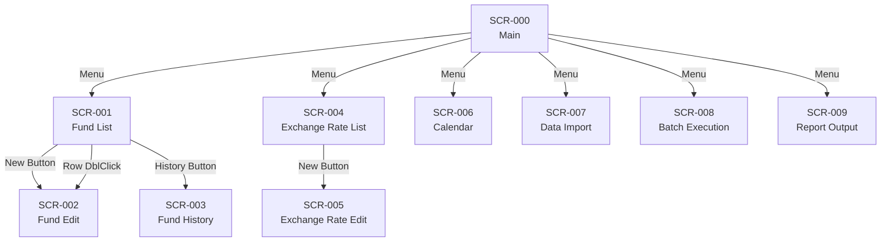

# 画面設計書

## 外国籍投資信託管理システム

| 項目 | 内容 |
|------|------|
| 文書番号 | BD-003 |
| 版数 | 1.2 |
| 作成日 | 2026-02-20 |
| 最終更新日 | 2026-02-20 |

### 改訂履歴

| 版数 | 日付 | 変更内容 | 作成者 |
|------|------|----------|--------|
| 1.0 | 2026-02-20 | 初版作成 | ― |
| 1.1 | 2026-02-20 | ワイヤーフレームを英語ASCII art + 日本語マッピング表に変更 | ― |
| 1.2 | 2026-02-20 | SCR-001 に論理削除ボタンを追加 | ― |

---

## 1. 画面一覧

| 画面ID | 画面名 | Form クラス名 | 機能ID | 概要 |
|--------|--------|-------------|--------|------|
| SCR-000 | メイン画面 | FrmMain | ― | MDI 親画面。メニューバーから各画面を起動 |
| SCR-001 | ファンド一覧画面 | FrmFundList | F-001 | ファンドの検索・一覧表示・CSVエクスポート |
| SCR-002 | ファンド登録・編集画面 | FrmFundEdit | F-001 | ファンド情報の新規登録および編集 |
| SCR-003 | ファンド変更履歴画面 | FrmFundHistory | F-001 | 選択ファンドの変更履歴を時系列表示 |
| SCR-004 | 為替レート一覧画面 | FrmExchangeRateList | F-002 | 為替レートの検索・一覧表示 |
| SCR-005 | 為替レート登録画面 | FrmExchangeRateEdit | F-002 | 為替レートの手入力登録 |
| SCR-006 | 営業日カレンダー画面 | FrmCalendar | F-003 | カレンダー形式で営業日/休日を表示・編集 |
| SCR-007 | データ取込画面 | FrmDataImport | F-004 | CSV取込の実行・結果表示 |
| SCR-008 | バッチ手動実行画面 | FrmBatchExecution | F-005 | 基準価額計算バッチの手動実行・結果確認 |
| SCR-009 | 帳票出力画面 | FrmReportOutput | F-006 | 月次運用レポートの対象指定・Excel出力 |

---

## 2. 画面遷移図



---

## 3. 画面共通仕様

### 3.1 MDI 構成

- メイン画面（FrmMain）をMDI親ウィンドウとし、各業務画面をMDI子ウィンドウとして開く
- 同一画面の多重起動は禁止する（既に開いている場合はアクティブ化）
- 画面サイズはユーザーによるリサイズを許可する

### 3.2 メッセージボックス仕様

| 種別 | アイコン | ボタン | 使用場面 |
|------|---------|--------|---------|
| 情報 | Information | OK | 処理完了の通知 |
| 確認 | Question | はい / いいえ | 登録・削除前の確認 |
| 警告 | Warning | OK | 業務警告の通知 |
| エラー | Error | OK | バリデーションエラー、業務エラー |

### 3.3 入力制御の共通ルール

| ルール | 内容 |
|--------|------|
| 必須チェック | 必須項目が未入力の場合、該当項目の背景色を薄黄色に変更し、エラーメッセージを表示 |
| 桁数チェック | 最大桁数を超える入力は受け付けない（MaxLength 設定） |
| 数値入力 | 数値項目は KeyPress イベントで数字・小数点・マイナス以外の入力を抑止 |
| 日付入力 | DateTimePicker コントロールを使用し、不正な日付入力を防止 |
| コード入力 | コンボボックス（DropDownList モード）でマスタから選択。自由入力不可 |

### 3.4 DataGridView 共通仕様

| 項目 | 設定 |
|------|------|
| 編集可否 | ReadOnly = True（一覧表示専用） |
| 選択モード | 行選択（FullRowSelect） |
| 列ヘッダークリック | ソート機能を有効化 |
| 交互行の背景色 | 薄い灰色（AlternatingRowsDefaultCellStyle） |
| 行番号 | RowPostPaint イベントで行番号を描画 |

---

## 4. 各画面の設計

### 4.1 SCR-000：メイン画面（FrmMain）

#### ワイヤーフレーム

```
+--------------------------------------------------------------+
|  Foreign Fund Manager                             [_][O][X]  |
+--------------------------------------------------------------+
|  [Master(M)]  [Import(D)]  [Calc(C)]  [Report(R)]            |
|   +- Fund         +- Data Import  +- Batch Run  +- Monthly   |
|   +- Rate                                                    |
|   +- Calendar                                                |
+--------------------------------------------------------------+
|                                                              |
|                                                              |
|                    ( MDI Client Area )                       |
|                                                              |
|                  Child forms appear here                     |
|                                                              |
|                                                              |
+--------------------------------------------------------------+
|  User: admin          |  Date: 2025/01/15                    |
+--------------------------------------------------------------+
```

#### ラベルマッピング

| 英語ラベル | 日本語表示名 | 説明 |
|-----------|------------|------|
| Foreign Fund Manager | 外国籍投資信託管理システム | タイトルバー |
| Master(M) | マスタ管理(M) | メニュー |
| Fund | ファンドマスタ(F) | サブメニュー → SCR-001 起動 |
| Rate | 為替レート(E) | サブメニュー → SCR-004 起動 |
| Calendar | 営業日カレンダー(C) | サブメニュー → SCR-006 起動 |
| Import(D) | データ取込(D) | メニュー |
| Data Import | データ取込(I) | サブメニュー → SCR-007 起動 |
| Calc(C) | 計算処理(C) | メニュー |
| Batch Run | バッチ実行(B) | サブメニュー → SCR-008 起動 |
| Report(R) | 帳票(R) | メニュー |
| Monthly | 月次レポート(M) | サブメニュー → SCR-009 起動 |

#### メニュー構成

| メニュー | サブメニュー | アクセスキー | 起動画面 |
|---------|------------|------------|---------|
| マスタ管理(M) | ファンドマスタ(F) | Alt+M → F | SCR-001 |
| | 為替レート(E) | Alt+M → E | SCR-004 |
| | 営業日カレンダー(C) | Alt+M → C | SCR-006 |
| データ取込(D) | データ取込(I) | Alt+D → I | SCR-007 |
| 計算処理(C) | バッチ実行(B) | Alt+C → B | SCR-008 |
| 帳票(R) | 月次レポート(M) | Alt+R → M | SCR-009 |

#### ステータスバー

| 領域 | 表示内容 |
|------|---------|
| 左側 | ユーザー名（App.config の UserName） |
| 右側 | 現在日付（yyyy/MM/dd 形式） |

---

### 4.2 SCR-001：ファンド一覧画面（FrmFundList）

#### ワイヤーフレーム

```
+--------------------------------------------------------------+
|  Fund List                                        [_][O][X]  |
+--------------------------------------------------------------+
|  [ Search Criteria ]                                         |
|                                                              |
|    ISIN:      [____________]     Currency: [v All        ]   |
|    Fund Name: [________________________]                     |
|    Country:   [v All        ]    Status:  (*) Active Only    |
|                                           ( ) Show All       |
|                                                              |
|                                  [Search]  [Clear]           |
+--------------------------------------------------------------+
|  [+ New]  [Delete]  [History]  [CSV Export]                  |
|                                                              |
|  +--+--------+----------------+------------+---+-----+------+|
|  |No| ISIN   | Fund Name(EN)  | Name(JP)   |CCY|CTRY |Status||
|  +--+--------+----------------+------------+---+-----+------+|
|  | 1|LU01234 |Global Equity   |            |USD| LU  | Act  ||
|  | 2|IE00ABC |Euro Bond Fund  |            |EUR| IE  | Act  ||
|  | 3|KY98765 |Asia Pacific    |            |USD| KY  | Act  ||
|  |  |        |                |            |   |     |      ||
|  +--+--------+----------------+------------+---+-----+------+|
|                                                              |
|  Results: 3 records                                          |
+--------------------------------------------------------------+
```

#### ラベルマッピング

| 英語ラベル | 日本語表示名 |
|-----------|------------|
| Fund List | ファンド一覧 |
| Search Criteria | 検索条件 |
| ISIN | ISIN |
| Fund Name | ファンド名 |
| Currency | 通貨 |
| Country | 籍国 |
| Status | ステータス |
| Active Only | 有効のみ |
| Show All | 全て表示 |
| Search | 検索 |
| Clear | クリア |
| + New | 新規登録 |
| Delete | 削除 |
| History | 変更履歴 |
| CSV Export | CSVエクスポート |
| Fund Name(EN) | ファンド名称（英語） |
| Name(JP) | ファンド名称（日本語） |
| CCY | 通貨 |
| CTRY | 籍国 |
| Results: N records | 検索結果: N 件 |

#### 画面項目定義

**検索条件部**

| # | 項目名 | コントロール | 必須 | 初期値 | 説明 |
|---|--------|------------|------|--------|------|
| 1 | ISIN | TextBox | ― | 空 | 前方一致検索 |
| 2 | ファンド名 | TextBox | ― | 空 | 英語名・日本語名の部分一致検索（OR） |
| 3 | 通貨 | ComboBox (DropDownList) | ― | 全て | M_CURRENCY から取得。先頭に「全て」を追加 |
| 4 | 籍国 | ComboBox (DropDownList) | ― | 全て | M_COUNTRY から取得。先頭に「全て」を追加 |
| 5 | ステータス | RadioButton | ― | 有効のみ | 有効のみ / 全て表示 |

**ボタン部**

| # | ボタン名 | アクション |
|---|---------|-----------|
| 1 | 検索 | 検索条件に合致するファンドを一覧に表示 |
| 2 | クリア | 検索条件を初期値に戻し、一覧をクリア |
| 3 | 新規登録 | SCR-002 を新規登録モードで開く |
| 4 | 削除 | 一覧で選択中のファンドを論理削除する（未選択時は無効）。確認ダイアログ表示後、STATUS を '9' に更新し、T_AUDIT_LOG に記録 |
| 5 | 変更履歴 | 一覧で選択中のファンドの SCR-003 を開く（未選択時は無効） |
| 6 | CSVエクスポート | 現在の一覧内容を CSV ファイルに出力（保存ダイアログ表示） |

**一覧部（DataGridView）**

| # | 列名 | 表示幅 | バインド元 | 書式 |
|---|------|-------|-----------|------|
| 1 | No | 40px | （行番号） | ― |
| 2 | ISIN | 120px | ISIN | ― |
| 3 | ファンド名称（英語） | 200px | FUND_NAME_EN | ― |
| 4 | ファンド名称（日本語） | 200px | FUND_NAME_JP | ― |
| 5 | 通貨 | 60px | CURRENCY_CODE | ― |
| 6 | 籍国 | 60px | DOMICILE_COUNTRY_CODE | ― |
| 7 | 状態 | 80px | STATUS | コード値→名称変換表示 |

#### イベント処理

| イベント | 処理内容 |
|---------|---------|
| 画面ロード | 通貨コンボ・籍国コンボにマスタデータをバインド。検索条件「有効のみ」で自動検索 |
| 検索ボタンクリック | FundService.Search() を呼び出し、結果を DataGridView にバインド。件数をステータスに表示 |
| 一覧行ダブルクリック | 選択行の ISIN を渡して SCR-002 を編集モードで開く |
| 新規登録ボタンクリック | SCR-002 を新規登録モードで開く |
| 削除ボタンクリック | ① 未選択チェック → ② 確認ダイアログ「ISIN: {ISIN} を削除しますか？」表示 → ③ FundService.Delete() 呼出（STATUS='9' に更新 + T_AUDIT_LOG 記録）→ ④ 成功時：一覧を再検索 |
| 変更履歴ボタンクリック | 選択行の ISIN を渡して SCR-003 を開く |
| CSVエクスポートクリック | SaveFileDialog を表示し、指定パスに CSV を出力 |

---

### 4.3 SCR-002：ファンド登録・編集画面（FrmFundEdit）

#### ワイヤーフレーム

```
+--------------------------------------------------------------+
|  Fund Edit                                        [_][O][X]  |
+--------------------------------------------------------------+
|                                                              |
|  ISIN *:             [____________]   << ReadOnly on Edit    |
|                                                              |
|  Fund Name(EN) *:    [__________________________________]    |
|                                                              |
|  Fund Name(JP) *:    [__________________________________]    |
|                                                              |
|  Currency *:         [v USD - US Dollar       ]              |
|                                                              |
|  Domicile *:         [v LU - Luxembourg       ]              |
|                                                              |
|  Inception Date *:   [2025/01/15       ][v]                  |
|                                                              |
|  Settlement Freq *:  [v Annual                ]              |
|                                                              |
|  Rounding *:         [v Truncate              ]              |
|                                                              |
|  Remarks:            [__________________________________]    |
|                      [__________________________________]    |
|                                                              |
|                               [Save]  [Cancel]               |
|                                                              |
|  * = Required field                                          |
+--------------------------------------------------------------+
```

#### ラベルマッピング

| 英語ラベル | 日本語表示名 |
|-----------|------------|
| Fund Edit | ファンド登録・編集 |
| ISIN | ISIN |
| Fund Name(EN) | ファンド名称（英語） |
| Fund Name(JP) | ファンド名称（日本語） |
| Currency | 通貨コード |
| Domicile | 籍国 |
| Inception Date | 設定日 |
| Settlement Freq | 決算頻度 |
| Rounding | 端数処理 |
| Remarks | 備考 |
| Save | 保存 |
| Cancel | キャンセル |
| ReadOnly on Edit | 編集時は読取専用 |

#### 画面項目定義

| # | 項目名 | コントロール | 必須 | 読取専用（編集時） | バインド先カラム | 説明 |
|---|--------|------------|------|-----------------|---------------|------|
| 1 | ISIN | TextBox | ○ | ○ | ISIN | MaxLength=12。新規時のみ入力可 |
| 2 | ファンド名称（英語） | TextBox | ○ | ― | FUND_NAME_EN | MaxLength=200 |
| 3 | ファンド名称（日本語） | TextBox | ○ | ― | FUND_NAME_JP | MaxLength=200 |
| 4 | 通貨コード | ComboBox | ○ | ― | CURRENCY_CODE | M_CURRENCY から取得 |
| 5 | 籍国 | ComboBox | ○ | ― | DOMICILE_COUNTRY_CODE | M_COUNTRY から取得 |
| 6 | 設定日 | DateTimePicker | ○ | ― | INCEPTION_DATE | 未来日不可 |
| 7 | 決算頻度 | ComboBox | ○ | ― | SETTLEMENT_FREQUENCY | M_CODE（SETTLEMENT_FREQ）から取得 |
| 8 | 端数処理 | ComboBox | ○ | ― | ROUNDING_TYPE | M_CODE（ROUNDING_TYPE）から取得 |
| 9 | 備考 | TextBox (Multiline) | ― | ― | REMARKS | MaxLength=500 |

#### イベント処理

| イベント | 処理内容 |
|---------|---------|
| 画面ロード（新規モード） | 全コンボボックスにマスタデータをバインド。ISIN は入力可能状態 |
| 画面ロード（編集モード） | 対象 ISIN のファンド情報を取得し各項目にセット。ISIN は読取専用 |
| 保存ボタンクリック | ① 必須チェック → ② ISIN 形式チェック（新規時）→ ③ FundService.Save() 呼出 → ④ 成功時：メッセージ表示し画面を閉じる。⑤ 失敗時：エラーメッセージ表示 |
| キャンセルボタンクリック | 変更確認ダイアログ（「変更内容を破棄しますか？」）を表示し、「はい」で画面を閉じる |

#### バリデーションフロー（保存時）

```
1. UI-side check (required fields, max length)
    | NG -> Show error, focus on field
    | OK
    v
2. Service-side check (FundService.Validate)
    +-- ISIN check digit (Luhn algorithm)
    +-- ISIN duplicate check (new registration only)
    +-- Currency code existence check
    +-- Country code existence check
    +-- Inception date future date check
    | NG -> BusinessException -> Show error
    | OK
    v
3. DB insert/update (M_FUND + T_AUDIT_LOG in same transaction)
```

---

### 4.4 SCR-003：ファンド変更履歴画面（FrmFundHistory）

#### ワイヤーフレーム

```
+--------------------------------------------------------------+
|  Fund Change History                              [_][O][X]  |
+--------------------------------------------------------------+
|                                                              |
|  Target: LU0123456789 - Global Equity Fund                   |
|                                                              |
|  +--+-----------+------+----------+--------+--------+------+ |
|  |No| Timestamp |Type  | Column   | Before | After  |  By  | |
|  +--+-----------+------+----------+--------+--------+------+ |
|  | 1|2025/01/15 |UPDATE|FUND_NAME |Global  |Global  |admin | |
|  |  | 10:30:00  |      |_JP       |Equity  |Equity F|      | |
|  | 2|2025/01/10 |INSERT|(All)     | --     | --     |admin | |
|  |  | 09:15:00  |      |          |        |        |      | |
|  +--+-----------+------+----------+--------+--------+------+ |
|                                                              |
|  Records: 2                                                  |
|                                                              |
|                                             [Close]          |
+--------------------------------------------------------------+
```

#### ラベルマッピング

| 英語ラベル | 日本語表示名 |
|-----------|------------|
| Fund Change History | ファンド変更履歴 |
| Target | 対象ファンド |
| Timestamp | 操作日時 |
| Type | 種別 |
| Column | 変更項目 |
| Before | 変更前 |
| After | 変更後 |
| By | 操作者 |
| (All) | （全項目） |
| Close | 閉じる |

#### 画面項目定義

**ヘッダ部**

| # | 項目名 | 表示内容 |
|---|--------|---------|
| 1 | 対象ファンド | ISIN + ファンド名称（英語） |

**一覧部（DataGridView）**

| # | 列名 | 表示幅 | バインド元 | 書式 |
|---|------|-------|-----------|------|
| 1 | No | 40px | （行番号） | ― |
| 2 | 操作日時 | 140px | OPERATED_AT | yyyy/MM/dd HH:mm:ss |
| 3 | 種別 | 60px | OPERATION_TYPE | INSERT→登録, UPDATE→編集, DELETE→削除 |
| 4 | 変更項目 | 150px | COLUMN_NAME | INSERT時は「（全項目）」 |
| 5 | 変更前 | 150px | OLD_VALUE | INSERT時は「―」 |
| 6 | 変更後 | 150px | NEW_VALUE | DELETE時は「―」 |
| 7 | 操作者 | 80px | OPERATED_BY | ― |

#### イベント処理

| イベント | 処理内容 |
|---------|---------|
| 画面ロード | 対象 ISIN の変更履歴を T_AUDIT_LOG から取得し、操作日時の降順で一覧に表示 |
| 閉じるボタンクリック | 画面を閉じる |

---

### 4.5 SCR-004：為替レート一覧画面（FrmExchangeRateList）

#### ワイヤーフレーム

```
+--------------------------------------------------------------+
|  Exchange Rate List                               [_][O][X]  |
+--------------------------------------------------------------+
|  [ Search Criteria ]                                         |
|                                                              |
|    Currency: [v All        ]                                 |
|    Period:   [2025/01/01][v]  -  [2025/01/31][v]             |
|                                                              |
|                                  [Search]  [Clear]           |
+--------------------------------------------------------------+
|  [+ New]                                                     |
|                                                              |
|  +--+----+------------+-----------+-----------+-----------+  |
|  |No|CCY | Rate Date  |    TTM    |    TTS    |    TTB    |  |
|  +--+----+------------+-----------+-----------+-----------+  |
|  | 1|USD | 2025/01/15 |  150.0000 |  151.0000 |  149.0000 |  |
|  | 2|USD | 2025/01/14 |  149.5000 |  150.5000 |  148.5000 |  |
|  | 3|EUR | 2025/01/15 |  163.4500 |  164.4500 |  162.4500 |  |
|  | 4|EUR | 2025/01/14 |  163.2000 |  164.2000 |  162.2000 |  |
|  | 5|GBP | 2025/01/15 |  190.0000 |  191.0000 |  189.0000 |  |
|  +--+----+------------+-----------+-----------+-----------+  |
|                                                              |
|  Results: 5 records                                          |
+--------------------------------------------------------------+
```

#### ラベルマッピング

| 英語ラベル | 日本語表示名 |
|-----------|------------|
| Exchange Rate List | 為替レート一覧 |
| Currency | 通貨 |
| Period | 期間 |
| Rate Date | 基準日 |
| TTM | TTM（仲値） |
| TTS | TTS（売レート） |
| TTB | TTB（買レート） |
| + New | 新規登録 |

#### 画面項目定義

**検索条件部**

| # | 項目名 | コントロール | 必須 | 初期値 | 説明 |
|---|--------|------------|------|--------|------|
| 1 | 通貨 | ComboBox (DropDownList) | ― | 全て | M_CURRENCY から取得 |
| 2 | 期間（From） | DateTimePicker | ― | 当月1日 | 検索範囲の開始日 |
| 3 | 期間（To） | DateTimePicker | ― | 当日 | 検索範囲の終了日 |

**一覧部（DataGridView）**

| # | 列名 | 表示幅 | バインド元 | 書式 |
|---|------|-------|-----------|------|
| 1 | No | 40px | （行番号） | ― |
| 2 | 通貨 | 60px | CURRENCY_CODE | ― |
| 3 | 基準日 | 110px | RATE_DATE | yyyy/MM/dd |
| 4 | TTM | 100px | TTM | #,##0.0000 |
| 5 | TTS | 100px | TTS | #,##0.0000 |
| 6 | TTB | 100px | TTB | #,##0.0000 |

#### イベント処理

| イベント | 処理内容 |
|---------|---------|
| 画面ロード | 通貨コンボにマスタデータをバインド。当月分のレートを自動検索 |
| 検索ボタンクリック | ExchangeRateService.Search() を呼び出し結果を表示 |
| 新規登録ボタンクリック | SCR-005 を開く |

---

### 4.6 SCR-005：為替レート登録画面（FrmExchangeRateEdit）

#### ワイヤーフレーム

```
+--------------------------------------------------------------+
|  Exchange Rate Entry                              [_][O][X]  |
+--------------------------------------------------------------+
|                                                              |
|  Currency *:   [v USD - US Dollar      ]                     |
|                                                              |
|  Rate Date *:  [2025/01/15       ][v]                        |
|                                                              |
|  TTM (Mid) *:  [__________]  JPY                             |
|                                                              |
|  TTS (Sell) *: [__________]  JPY                             |
|                                                              |
|  TTB (Buy) *:  [__________]  JPY                             |
|                                                              |
|                               [Save]  [Cancel]               |
|                                                              |
|  * = Required field                                          |
|  Note: TTB <= TTM <= TTS must be satisfied                   |
+--------------------------------------------------------------+
```

#### ラベルマッピング

| 英語ラベル | 日本語表示名 |
|-----------|------------|
| Exchange Rate Entry | 為替レート登録 |
| Currency | 通貨コード |
| Rate Date | 基準日 |
| TTM (Mid) | TTM（仲値） |
| TTS (Sell) | TTS（売レート） |
| TTB (Buy) | TTB（買レート） |
| Note: TTB <= TTM <= TTS... | ※ TTB ≤ TTM ≤ TTS の関係を満たすこと |

#### 画面項目定義

| # | 項目名 | コントロール | 必須 | バインド先カラム | 説明 |
|---|--------|------------|------|---------------|------|
| 1 | 通貨コード | ComboBox | ○ | CURRENCY_CODE | M_CURRENCY から取得 |
| 2 | 基準日 | DateTimePicker | ○ | RATE_DATE | 未来日不可 |
| 3 | TTM | TextBox | ○ | TTM | 数値入力。小数6桁まで |
| 4 | TTS | TextBox | ○ | TTS | 数値入力。小数6桁まで |
| 5 | TTB | TextBox | ○ | TTB | 数値入力。小数6桁まで |

#### バリデーションフロー（保存時）

```
1. UI-side check (required, numeric format)
    | OK
    v
2. Service-side check (ExchangeRateService.Validate)
    +-- Rate order check (TTB <= TTM <= TTS)
    +-- Future date check
    +-- Duplicate check (same currency + same date)
    | OK
    v
3. DB insert (M_EXCHANGE_RATE)
```

---

### 4.7 SCR-006：営業日カレンダー画面（FrmCalendar）

#### ワイヤーフレーム

```
+--------------------------------------------------------------+
|  Business Calendar                                [_][O][X]  |
+--------------------------------------------------------------+
|                                                              |
|  Region: [v JP - Japan    ]    Month: [<] [2025 / 01] [>]    |
|                                                              |
|  +-------+-------+-------+-------+-------+-------+-------+   |
|  |  Mon  |  Tue  |  Wed  |  Thu  |  Fri  |  Sat  |  Sun  |   |
|  +-------+-------+-------+-------+-------+-------+-------+   |
|  |       |       |   1   |   2   |   3   |   4   |   5   |   |
|  |       |       | [H]   | [H]   | [H]   | (sat) | (sun) |   |
|  |       |       | NewYr | NY-2  | NY-3  |       |       |   |
|  +-------+-------+-------+-------+-------+-------+-------+   |
|  |   6   |   7   |   8   |   9   |  10   |  11   |  12   |   |
|  |       |       |       |       |       | (sat) | (sun) |   |
|  +-------+-------+-------+-------+-------+-------+-------+   |
|  |  13   |  14   |  15   |  16   |  17   |  18   |  19   |   |
|  | [H]   |       |       |       |       | (sat) | (sun) |   |
|  | Adlt  |       |       |       |       |       |       |   |
|  +-------+-------+-------+-------+-------+-------+-------+   |
|  |  20   |  21   |  22   |  23   |  24   |  25   |  26   |   |
|  |       |       |       |       |       | (sat) | (sun) |   |
|  +-------+-------+-------+-------+-------+-------+-------+   |
|  |  27   |  28   |  29   |  30   |  31   |       |       |   |
|  |       |       |       |       |       |       |       |   |
|  +-------+-------+-------+-------+-------+-------+-------+   |
|                                                              |
|  Legend: (sat)=Saturday  (sun)=Sunday  [H]=Holiday(DB)       |
|                                                              |
|  -- Holiday Maintenance --                                   |
|  Date: [2025/01/20 ][v]   Name: [______________]             |
|  [+ Add Holiday]  [- Remove Holiday]                         |
|                                                              |
+--------------------------------------------------------------+
```

#### ラベルマッピング

| 英語ラベル | 日本語表示名 |
|-----------|------------|
| Business Calendar | 営業日カレンダー |
| Region | 地域 |
| Month | 年月 |
| [<] / [>] | 前月 / 翌月 |
| Mon - Sun | 月 - 日 |
| [H] | 休日（DB登録済み） |
| (sat) / (sun) | 土曜 / 日曜（自動判定） |
| NewYr | 元日 |
| NY-2 / NY-3 | 正月2日 / 正月3日 |
| Adlt | 成人の日 |
| Holiday Maintenance | 休日の追加・削除 |
| Date | 日付 |
| Name | 名称 |
| + Add Holiday | 休日追加 |
| - Remove Holiday | 休日削除 |

#### 画面項目定義

**カレンダー操作部**

| # | 項目名 | コントロール | 説明 |
|---|--------|------------|------|
| 1 | 地域 | ComboBox (DropDownList) | JP / US / LU。M_CODE（REGION_CODE）から取得 |
| 2 | 年月 | 前月・翌月ボタン | [<] [>] ボタンで月を切り替え |

**休日メンテナンス部**

| # | 項目名 | コントロール | 説明 |
|---|--------|------------|------|
| 3 | 日付 | DateTimePicker | 休日として登録/削除する日付 |
| 4 | 名称 | TextBox | 休日名称。MaxLength=100 |
| 5 | 休日追加ボタン | Button | 指定日を休日として M_CALENDAR に INSERT |
| 6 | 休日削除ボタン | Button | 指定日の休日レコードを M_CALENDAR から DELETE |

#### カレンダー表示ルール

| 日付の種別 | 背景色 | 表示 |
|-----------|--------|------|
| 平日（営業日） | 白 | 日付のみ |
| 土曜日 | 薄い青 | 日付のみ（自動判定） |
| 日曜日 | 薄い赤 | 日付のみ（自動判定） |
| 祝日・休業日（DB登録） | 赤 | 日付 + [H] + 休日名称 |

---

### 4.8 SCR-007：データ取込画面（FrmDataImport）

#### ワイヤーフレーム

```
+--------------------------------------------------------------+
|  Data Import                                      [_][O][X]  |
+--------------------------------------------------------------+
|                                                              |
|  Import Type *:  (*) NAV Data                                |
|                  ( ) Exchange Rate                           |
|                  ( ) Business Calendar                       |
|                                                              |
|  File *:         [____________________________] [Browse...]  |
|                                                              |
|  File Info:      Size: 1.2 KB  /  Rows: 4 (excl. header)     |
|                                                              |
|                                       [>> Execute Import]    |
|                                                              |
|  -- Import Result ------------------------------------------ |
|                                                              |
|  Status: [OK] Success                                        |
|  Total: 3  Success: 3  Error: 0  Warning: 1                  |
|  Elapsed: 0.5 sec                                            |
|                                                              |
|  +--+------+-----+------------------------------------------+|
|  |No| Type | Row | Message                                  ||
|  +--+------+-----+------------------------------------------+|
|  | 1| WARN |   2 | NAV change rate exceeds threshold(12.5%) ||
|  |  |      |     | ISIN: LU0123456789                       ||
|  +--+------+-----+------------------------------------------+|
|                                                              |
+--------------------------------------------------------------+
```

#### ラベルマッピング

| 英語ラベル | 日本語表示名 |
|-----------|------------|
| Data Import | データ取込 |
| Import Type | 取込種別 |
| NAV Data | NAVデータ |
| Exchange Rate | 為替レート |
| Business Calendar | 営業日カレンダー |
| File | ファイル |
| Browse... | 参照... |
| File Info | ファイル情報 |
| Size / Rows | サイズ / 行数 |
| Execute Import | 取込実行 |
| Import Result | 取込結果 |
| Status | ステータス |
| Total / Success / Error / Warning | 全件数 / 成功 / エラー / 警告 |
| Elapsed | 処理時間 |
| Type | 種別 |
| Row | 行番号 |
| Message | メッセージ |
| WARN | 警告 |
| ERR | エラー |

#### 画面項目定義

**入力部**

| # | 項目名 | コントロール | 必須 | 説明 |
|---|--------|------------|------|------|
| 1 | 取込種別 | RadioButton | ○ | NAVデータ / 為替レート / 営業日カレンダー |
| 2 | ファイルパス | TextBox + OpenFileDialog | ○ | 参照ボタンでファイル選択。拡張子 .csv のみ |

**結果表示部**

| # | 項目名 | 表示内容 |
|---|--------|---------|
| 3 | ステータス | 成功（OK） / エラー（NG） |
| 4 | 件数サマリ | 全件数 / 成功件数 / エラー件数 / 警告件数 |
| 5 | 処理時間 | 取込処理の所要時間 |
| 6 | 詳細一覧 | エラー・警告の行番号とメッセージ（T_IMPORT_LOG_DETAIL） |

#### イベント処理

| イベント | 処理内容 |
|---------|---------|
| 参照ボタンクリック | OpenFileDialog を表示（フィルタ: CSV files (*.csv)）。選択後にファイル情報を表示 |
| 取込実行ボタンクリック | ① ファイル存在・サイズ・拡張子チェック → ② DataImportService.Import() 呼出 → ③ 結果を画面に表示 |
| 取込種別の変更 | 結果表示部をクリアする |

---

### 4.9 SCR-008：バッチ手動実行画面（FrmBatchExecution）

#### ワイヤーフレーム

```
+--------------------------------------------------------------+
|  NAV Calculation Batch                            [_][O][X]  |
+--------------------------------------------------------------+
|                                                              |
|  Target Date *:  [2025/01/15       ][v]                      |
|                                                              |
|                                       [>> Execute]           |
|                                                              |
|  -- Execution Result --------------------------------------- |
|                                                              |
|  Status: [OK] Completed                                      |
|  Total: 10  Success: 9  Skipped: 1  Error: 0                 |
|  Elapsed: 2.3 sec                                            |
|                                                              |
|  +--+--------+---+----------+----------+-----------+-------+ |
|  |No| ISIN   |CCY| NAV(FCY) | TTM Rate | NAV(JPY)  | Note  | |
|  +--+--------+---+----------+----------+-----------+-------+ |
|  | 1|LU01234 |USD|   52.3400|  150.0000|      7,851|       | |
|  | 2|IE00ABC |EUR|  101.8700|  163.4500|     16,651|       | |
|  | 3|KY98765 |USD|   28.9100|  150.0000|      4,337| *Prev | |
|  |  |        |   |          |          |           |       | |
|  +--+--------+---+----------+----------+-----------+-------+ |
|                                                              |
|  *Prev = Previous business day rate applied                  |
+--------------------------------------------------------------+
```

#### ラベルマッピング

| 英語ラベル | 日本語表示名 |
|-----------|------------|
| NAV Calculation Batch | 基準価額計算バッチ実行 |
| Target Date | 対象日付 |
| Execute | 実行 |
| Execution Result | 実行結果 |
| Completed | 正常終了 |
| Total / Success / Skipped / Error | 処理件数 / 成功 / スキップ / エラー |
| NAV(FCY) | 基準価額（外貨建て） |
| TTM Rate | 適用TTM |
| NAV(JPY) | 基準価額（円建て） |
| Note | 備考 |
| *Prev | 直前営業日レート使用 |

#### 画面項目定義

**入力部**

| # | 項目名 | コントロール | 必須 | 初期値 | 説明 |
|---|--------|------------|------|--------|------|
| 1 | 対象日付 | DateTimePicker | ○ | 当日 | バッチ処理の対象日付 |

**結果表示部（DataGridView）**

| # | 列名 | 表示幅 | バインド元 | 書式 |
|---|------|-------|-----------|------|
| 1 | No | 40px | （行番号） | ― |
| 2 | ISIN | 120px | ISIN | ― |
| 3 | 通貨 | 60px | CURRENCY_CODE | ― |
| 4 | 外貨建NAV | 100px | NAV_PER_UNIT | #,##0.0000 |
| 5 | 適用TTM | 100px | APPLIED_RATE | #,##0.0000 |
| 6 | 円建NAV | 100px | NAV_JPY | #,##0 |
| 7 | 備考 | 80px | （判定結果） | 直前営業日レート使用時は「*Prev」 |

#### イベント処理

| イベント | 処理内容 |
|---------|---------|
| 実行ボタンクリック | ① 確認ダイアログ表示 → ② NavCalculationService.Execute() 呼出 → ③ 結果を一覧に表示 |

---

### 4.10 SCR-009：帳票出力画面（FrmReportOutput）

#### ワイヤーフレーム

```
+--------------------------------------------------------------+
|  Monthly Report Output                            [_][O][X]  |
+--------------------------------------------------------------+
|                                                              |
|  Target Period *:  [v 2025]  /  [v 01]                       |
|                                                              |
|  Target Funds * (multi-select):                              |
|  +----------------------------------------------------------+|
|  |  [x] LU0123456789 - Global Equity Fund                   ||
|  |  [x] IE00ABCDEF01 - Euro Bond Fund                       ||
|  |  [ ] KY9876543210 - Asia Pacific Fund                    ||
|  +----------------------------------------------------------+|
|  [Check All]  [Uncheck All]                                  |
|                                                              |
|  Output Folder *: [C:\Reports              ] [Browse...]     |
|                                                              |
|                                       [>> Generate Report]   |
|                                                              |
|  -- Output Result ------------------------------------------ |
|  [OK] 2 report(s) generated.                                 |
|  - MonthlyReport_LU0123456789_202501.xlsx                    |
|  - MonthlyReport_IE00ABCDEF01_202501.xlsx                    |
|                                                              |
+--------------------------------------------------------------+
```

#### ラベルマッピング

| 英語ラベル | 日本語表示名 |
|-----------|------------|
| Monthly Report Output | 月次運用レポート出力 |
| Target Period | 対象年月 |
| Target Funds | 対象ファンド |
| multi-select | 複数選択可 |
| Check All | 全選択 |
| Uncheck All | 全解除 |
| Output Folder | 出力先 |
| Browse... | 参照... |
| Generate Report | 出力実行 |
| Output Result | 出力結果 |
| N report(s) generated | N件のレポートを出力しました |

#### 画面項目定義

**入力部**

| # | 項目名 | コントロール | 必須 | 説明 |
|---|--------|------------|------|------|
| 1 | 対象年 | ComboBox | ○ | 年選択（当年を初期値） |
| 2 | 対象月 | ComboBox | ○ | 月選択（前月を初期値） |
| 3 | 対象ファンド | CheckedListBox | ○ | M_FUND（有効ステータス）から取得。1件以上選択必須 |
| 4 | 出力先フォルダ | TextBox + FolderBrowserDialog | ○ | 参照ボタンでフォルダ選択 |

#### イベント処理

| イベント | 処理内容 |
|---------|---------|
| 画面ロード | 年コンボ・月コンボを設定。ファンド一覧をバインド |
| 全選択ボタンクリック | CheckedListBox の全項目をチェック |
| 全解除ボタンクリック | CheckedListBox の全項目をアンチェック |
| 出力実行ボタンクリック | ① 入力チェック → ② ReportService.GenerateMonthlyReport() 呼出 → ③ 出力結果を表示 |

---

以上
